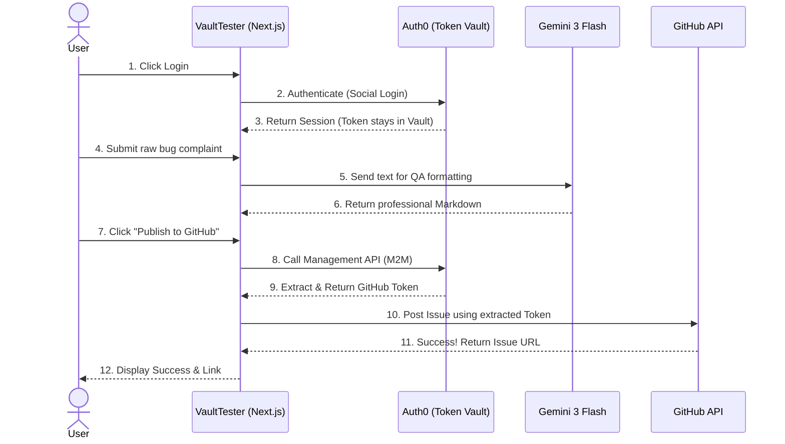

# 🛡️ VaultTester: Secure AI Bug Reporter

> **Built for the Okta/Auth0 Hackathon** 🚀

VaultTester is an AI-powered QA assistant that takes informal, raw bug complaints and transforms them into professional, industry-standard GitHub Issues. Most importantly, it completely eliminates the need for hardcoded Personal Access Tokens (PATs) by leveraging the **Auth0 Token Vault**.

## ✨ The Problem & The Solution

**The Problem:** AI Agents acting on behalf of users (like posting to external APIs such as GitHub) usually require developers to store sensitive Personal Access Tokens in environment variables or databases. This is a massive security risk.

**The Solution:** VaultTester uses **Auth0 Token Vault**. Users authenticate via GitHub Social Login through Auth0. When the AI agent is ready to publish the formatted report, our Next.js backend dynamically retrieves the user's temporary GitHub access token via the Auth0 Management API. 
**Result:** Zero hardcoded tokens. 100% Secure. The AI is fully *Authorized to Act*.

## 🚀 Key Features

- **Auth0 Social Login:** Secure authentication using GitHub.
- **Agentic AI Workflow:** Powered by **Google Gemini 3 Flash**, translating casual bug descriptions into structured Markdown (Title, Description, Steps to Reproduce, Expected/Actual Behavior).
- **Auth0 Token Vault Integration:** Securely extracts Identity Provider (IdP) tokens via Machine-to-Machine (M2M) Management API.
- **Direct GitHub Publishing:** Pushes the finalized QA report directly to the user's repository without exposing credentials.

## 🛠️ Tech Stack

- **Frontend:** Next.js (App Router), React, Tailwind CSS
- **Backend/API:** Next.js Route Handlers
- **Authentication:** Auth0 (Next.js SDK), Auth0 Management API
- **AI Model:** Google Generative AI (Gemini 3 Flash)
- **External API:** GitHub REST API

## ⚙️ How It Works (Security Architecture)

1. User logs in via Auth0 using their GitHub account.
2. Auth0 securely stores the GitHub `access_token` in its Token Vault.
3. User types a raw bug complaint and clicks "Format with AI".
4. Gemini 3 Flash processes the text and returns a professional Markdown QA report.
5. User clicks "Publish to GitHub".
6. The Next.js backend securely calls the **Auth0 Management API** to retrieve the user's stored GitHub token.
7. The Next.js backend uses that token to post the issue to the target GitHub repository.

### Architecture Flowchart



## Local Installation

To run this project locally, follow these steps:

### 1. Clone the repository
```bash
git clone [https://github.com/ArcVielLouvent/VaultTester-AI.git](https://github.com/ArcVielLouvent/VaultTester-AI.git)
cd vault-tester
```

### 2. Install dependencies
```Bash
npm install
```

### 3. Environment Variables
Create a `.env.local` file in the root directory and add the following keys:

```env
# Auth0 Configuration & Management API (M2M)
AUTH0_SECRET='your_auth0_secret_here'
AUTH0_BASE_URL='http://localhost:3000'
AUTH0_DOMAIN='your_auth0_domain_here'
AUTH0_CLIENT_ID='your_auth0_client_id_here'
AUTH0_CLIENT_SECRET='your_auth0_client_secret_here'

# Google Gemini AI
GEMINI_API_KEY='your_gemini_api_key_here'

# Target GitHub Repository
GITHUB_TARGET_REPO='your_github_target_repo_here'
```

### 4. Run the development server
```Bash
npm run dev
```
Open http://localhost:3000 with your browser to see the result.

> **Author**
Armand Al-Farizy
GitHub: @ArcVielLouvent
---
This project was submitted for the Okta/Auth0 Hackathon.